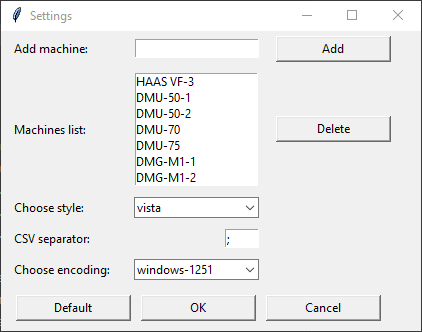
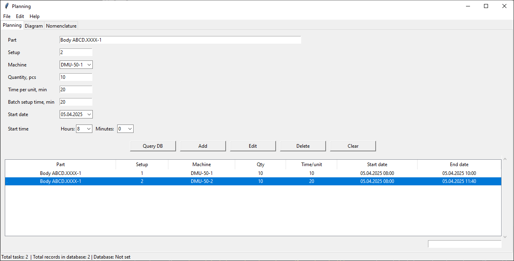
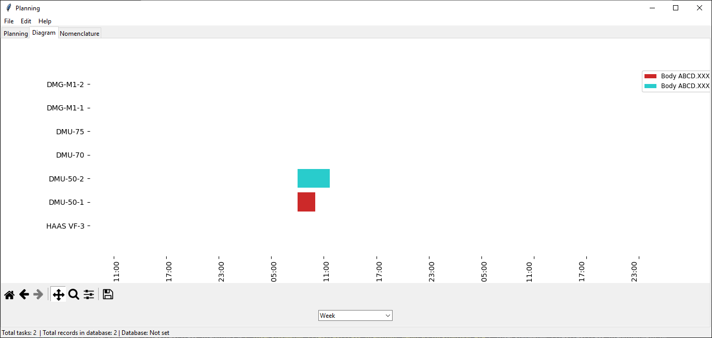
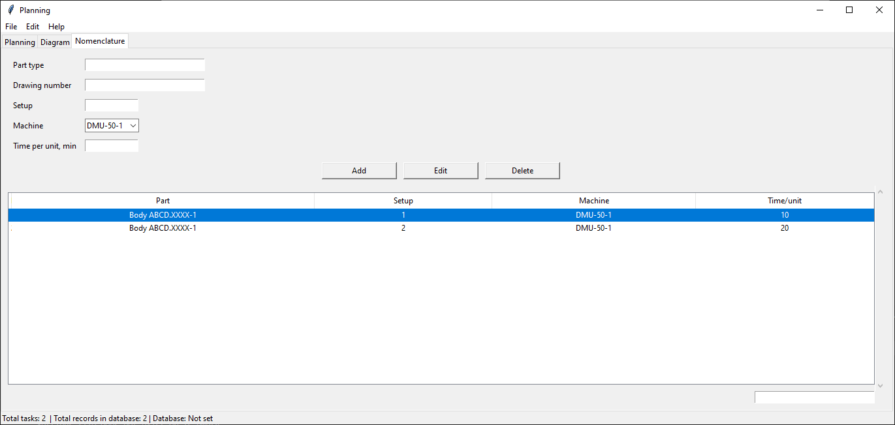

# User Manual

## Table of Contents

- [User Manual](#user-manual)
  - [Table of Contents](#table-of-contents)
  - [1. Main Menu](#1-main-menu)
    - [File Menu](#file-menu)
      - [The "File" menu is the main tool for managing the program (_see Image 1_)](#the-file-menu-is-the-main-tool-for-managing-the-program-see-image-1)
      - [It includes the following commands](#it-includes-the-following-commands)
    - [Edit Menu](#edit-menu)
      - [The "Edit" menu provides tools for working with text in the application's text fields](#the-edit-menu-provides-tools-for-working-with-text-in-the-applications-text-fields)
    - [Help Menu](#help-menu)
      - [The "Help" menu provides information about the program](#the-help-menu-provides-information-about-the-program)
    - [Settings Window](#settings-window)
      - [Loading and saving settings](#loading-and-saving-settings)
      - [Adding and removing machines](#adding-and-removing-machines)
  - [2. Main Application Window](#2-main-application-window)
    - [Planning Tab](#planning-tab)
      - [The "Planning" tab is designed for entering and managing tasks related to production processes (see Image 3)](#the-planning-tab-is-designed-for-entering-and-managing-tasks-related-to-production-processes-see-image-3)
      - [Main interface elements](#main-interface-elements)
      - [Task management buttons](#task-management-buttons)
      - [Filtering](#filtering)
    - [Diagram Tab](#diagram-tab)
      - [The "Diagram" tab is responsible for visualizing task planning in the form of a Gantt chart (see Image 4)](#the-diagram-tab-is-responsible-for-visualizing-task-planning-in-the-form-of-a-gantt-chart-see-image-4)
    - [Nomenclature Tab](#nomenclature-tab)
      - [The "Nomenclature" tab allows managing information about product nomenclature and their characteristics (see Image 5)](#the-nomenclature-tab-allows-managing-information-about-product-nomenclature-and-their-characteristics-see-image-5)
  - [3. Keyboard Shortcuts](#3-keyboard-shortcuts)
  - [4. Additional Functions](#4-additional-functions)
    - [Task Management](#task-management)
    - [Automatic Calculations](#automatic-calculations)
  - [5. Working with Data](#5-working-with-data)
    - [Import/Export](#importexport)
    - [Data Handling Recommendations](#data-handling-recommendations)
  - [6. Troubleshooting](#6-troubleshooting)
    - [Frequently Asked Questions](#frequently-asked-questions)
    - [Technical Support](#technical-support)
  - [7. Security](#7-security)
    - [Data Protection Recommendations](#data-protection-recommendations)
    - [Data Storage](#data-storage)
  - [8. License Agreement](#8-license-agreement)
    - [Usage Rights](#usage-rights)
    - [Restrictions](#restrictions)
    - [Warranties](#warranties)

---

## 1. Main Menu

### File Menu

#### The "File" menu is the main tool for managing the program (_see Image 1_)
<!-- markdownlint-disable MD033 -->

  

    
    
Image 1

  

#### It includes the following commands

- **Open Database**

  Allows the user to select and open a CSV file containing product nomenclature data. The application checks the file content and imports the data if they are correct. If the database does not open or opens with errors, it is recommended to change the CSV file delimiter or encoding in the settings window.

- **Save Database**

  Saves the current state of data in the opened database. If no database is open, the application will prompt the user to save the data to a new file.

- **Close Database**

  Closes the opened database. If the database has been modified, the application will prompt the user to save the data to that file.

- **Import Tasks from Excel**

  Allows importing tasks from an Excel file. The user selects a file, and the data is loaded into the application. For initializing the task list, you need to execute the "Export Tasks to Excel" command to obtain an Excel file template prepared for working with the program.

- **Export Tasks to Excel**

  Exports current tasks to a specified Excel file. Data can be structured according to user-defined parameters.

- **Export Diagram to Excel**

  Exports tasks and the diagram to an Excel file.

- **Settings**

  Opens a new window with application configuration parameters. The user can change various settings, including interface style, CSV file delimiter (for correct database import/export on different operating systems), CSV file encoding, and the list of machine models used in this production.

- **Exit**

  Closes the current application window.

---

### Edit Menu

#### The "Edit" menu provides tools for working with text in the application's text fields

- **Cut**

  Removes the selected text or data and places it in the clipboard, allowing the user to paste it elsewhere.

- **Copy**

  Copies the selected text or data to the clipboard without removing it from its current location. The user can paste it elsewhere after executing this command.

- **Paste**

  Pastes the contents of the clipboard at the current cursor position. If the clipboard contains text or data, they will be added to the active text field or table.

- **Select All**

  Selects all textual data or records in the current context (e.g., all rows in a table or all text in a text field). This allows the user to easily copy or delete all data at once.

---

### Help Menu

#### The "Help" menu provides information about the program

- **About**

  Opens a window with information about the application, its version, and author.

- **User Manual**

  This file contains the complete user guide for the program.

---

### Settings Window

  

    
    
Image 2

  

The application settings window, where the user can change parameters and add machines (see Image 2). It includes the following commands:

- **Add Machine**

  At the top of the window, there is a field for entering a new machine. The user can enter the name of a new machine and click the "Add" button to add it to the list.

- **Machine List**

  Displays the current list of all added machines. The user can select a machine from the list and click the "Delete" button to remove it.

- **Choose Style**

  Allows the user to select an interface style from the proposed list. This changes the appearance of the application according to the selected style.

- **CSV Delimiter**

  The user can specify the character to be used as a delimiter when working with CSV files. By default, it is a semicolon, but the user can change it to another character if necessary.

- **Choose Encoding**

  Allows selecting the encoding for CSV database files that will be used in the application. Options include "windows-1251" and "utf-8".

- **Control Buttons:**

  - **Default**
    Resets settings to default values.

  - **OK**
    Saves changes and closes the settings window.

  - **Cancel**
    Closes the settings window without saving changes.

#### Loading and saving settings

Settings are loaded from the `settings.json` file if it exists and is not empty. Otherwise, default values are loaded. When saving settings, data is written to the same file.

#### Adding and removing machines

The user can add new machines, and they will appear in the list. If the user tries to add an already existing machine, a warning will appear. Similarly, the user can remove a selected machine from the list.

---

## 2. Main Application Window

### Planning Tab

  

    
    
Image 3

  

#### The "Planning" tab is designed for entering and managing tasks related to production processes (see Image 3)

#### Main interface elements

- **Input field "Detail"**

  Used for entering the name of a detail with autocomplete, providing convenience for selection.

- **Input field "Setup"**

  Input of information about a specific setup (operation).

- **Dropdown list "Machine"**

  Allows selecting an available machine from the list of all machines.

- **Input field "Quantity, pcs"**

  Input of the number of details for processing.

- **Input field "Time per 1 pcs, min"**

  Input of the time required to process one detail in minutes.

- **Input field "Setup time for batch, min"**

  Input of the time required for equipment setup before starting a batch in minutes.

- **Calendar "Start Date"**

  Allows selecting the date on which the task is planned to start.

- **Selection field "Start Time"**

  Allows selecting the time at which the task is planned to start.

#### Task management buttons

- **Query to database**

  Sends a query to obtain data on the manufacturing time for one detail. The following fields must be filled for the query:

  - **Detail**
  - **Setup**
  - **Machine**

  Upon successful verification of matching values in the "Nomenclature" table, the "Time per 1 pcs, min" input field will be populated.

- **Add**

  Adds a new task to the table.

- **Edit**

  Allows editing the selected task. When clicked, an edit dialog appears where data in the following columns can be corrected:

  - **Detail**
  - **Setup**
  - **Machine**

- **Delete**

  Deletes the selected task from the table.

- **Clear**

  Clears the entire "Tasks" table.

- **Table "Tasks"**

  A table displaying all added tasks with columns:

  - **ID (identifier)**
  - **Detail**
  - **Setup**
  - **Machine**
  - **Qty**
  - **Time/pcs**
  - **Start date**
  - **End date**

  The table allows sorting rows alphabetically (double-click left mouse button on the top column). Also, if you select a row and press **Enter**, an edit dialog will appear where data in the following columns can be corrected:

  - **Detail**
  - **Setup**
  - **Machine**

  If you need to delete a task, simply press **Delete**. There is support for deleting multiple or all rows via `Ctrl + A`.

#### Filtering

A field for filtering rows in the tasks table.

---

### Diagram Tab

  

    
    
Image 4

  

#### The "Diagram" tab is responsible for visualizing task planning in the form of a Gantt chart (see Image 4)

- **Dropdown list "Range"**

  Allows selecting the displayed time range (day, week, month) for the diagram.

- **Diagram**

  Created using the Matplotlib library, it displays tasks depending on the selected time range, grouping them by machines.

- **Navigation Panel**

  Provides diagram control (zooming and panning).

---

### Nomenclature Tab

  

    
    
Image 5

  

#### The "Nomenclature" tab allows managing information about product nomenclature and their characteristics (see Image 5)

- **Input field "Detail Type"**

  For entering information about the type of detail.

- **Input field "Drawing Number"**

  For entering the drawing number of the detail.

- **Input field "Setup"**

  For specifying the setup, similar to the "Planning" tab.

- **Dropdown list "Machine"**

  For selecting a machine, similar to the "Planning" tab.

- **Input field "Time per 1 pcs, min"**

  Input of the time required to process one detail in minutes, similar to the "Planning" tab.

- **Nomenclature management buttons:**

  - **Add**

    Adds a new entry to the "Nomenclature" table.

  - **Edit**

    Allows editing the selected entry in the "Nomenclature" table. When clicked, an edit dialog appears where data of the selected table entry can be corrected.

  - **Delete**

    Deletes the selected task from the "Nomenclature" table.

- **Table "Nomenclature"**

  A table displaying all added tasks with columns:

  - **ID(identifier)**
  - **Detail**
  - **Setup**
  - **Machine**
  - **Time/pcs**

  Functionality similar to the table on the "Planning" tab.

---

## 3. Keyboard Shortcuts

| Shortcut        | Action                                        |
| --------------- | --------------------------------------------- |
| `Ctrl + O`      | Open database                                 |
| `Ctrl + S`      | Save database                                 |
| `Ctrl + Q`      | Exit the program                              |
| `Ctrl + C`      | Copy selected element                         |
| `Ctrl + X`      | Cut selected element                          |
| `Ctrl + V`      | Paste copied or cut element                   |
| `Ctrl + A`      | Select all                                    |
| `F1`            | "About" window                                |

---

## 4. Additional Functions

### Task Management

- **Batch Operations**
  To select multiple tasks, use:

  - `Shift + click` - select a range
  - `Ctrl + click` - selective selection
  - `Ctrl + A` - select all tasks

- **Context Menu**
  Right-click on a task opens a menu with quick actions:
  - Copy data
  - Delete task
  - Edit task

### Automatic Calculations

- **Execution Time**
  When adding a task, it is automatically calculated:
  `Total time = (Time per 1 pcs × Quantity) + Setup time`

- **End Date**
  Calculated based on:
  - Start date/time
  - Total execution time

---

## 5. Working with Data

### Import/Export

| Format | Capabilities                       | Limitations                     |
| ------ | ---------------------------------- | ------------------------------- |
| CSV    | Full database import/export        | Requires correct encoding       |
| Excel  | Import tasks, export reports       | Maximum 1000 rows at a time     |
| JSON   | Export settings and configurations | For technical purposes only     |

### Data Handling Recommendations

1. **Before import:**

   - Check data format compliance
   - Make a backup of current data

2. **When exporting:**

   - Select the required date range
   - Specify understandable file names

3. **Best Practices:**
   - Regular data saving (every 30 minutes)
   - Using filters before export
   - Cleaning up old tasks (once a month)

---

## 6. Troubleshooting

### Frequently Asked Questions

**Problem:** Data is not saved

**Solution:**

1. Check folder access permissions
2. Make sure the file is not open in another program
3. Try saving under a different name

**Problem:** Errors when importing CSV

**Solution:**

1. Check the delimiter in settings
2. Ensure correct encoding
3. Check file integrity

**Problem:** Diagram does not update

**Solution:**

1. Click the "Update" button
2. Check the date range
3. Restart the application

### Technical Support

**When contacting support, prepare:**

1. Program version (see "About")
2. Screenshot of the error
3. A copy of the last saved file

**Support contacts:**

- **Email:** [maestrofusion360@gmail.com](maestrofusion360@gmail.com)

---

## 7. Security

### Data Protection Recommendations

**Regular Backups** – save copies of all important data, including CSV files, in a separate location, such as an external drive or cloud storage. It is recommended to back up at least once a week. Also, use **data versioning** so that older versions of files can be restored if necessary.

### Data Storage

- All data is stored locally on your computer
- The program does not send data to the internet
- Settings are saved in the `settings.json` file

---

## 8. License Agreement

### Usage Rights

The program is provided under the **"Commercial License for 1 workstation"**.
The license grants the right to use the software on one physical or virtual workstation for commercial purposes. Use is permitted only to one user at a time. Distribution, transfer to third parties, and installation on additional devices without a separate license are prohibited.

### Restrictions

It is prohibited to:

- Modify the program code.
- Use the program for commercial purposes without a valid license.
- Remove copyright information from the program.

### Warranties

The program is provided "as is".
The developer is not responsible for:

- Data loss.
- Indirect damages.
- Incompatibility with other software.

---
