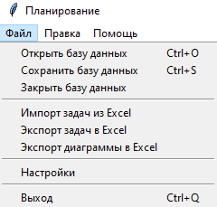
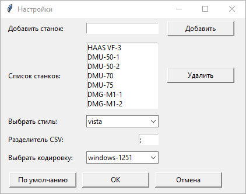
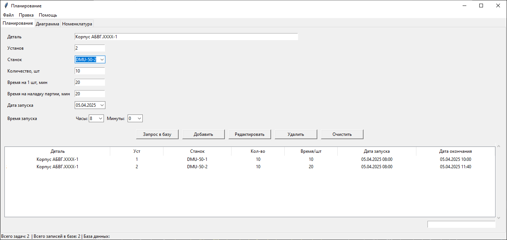
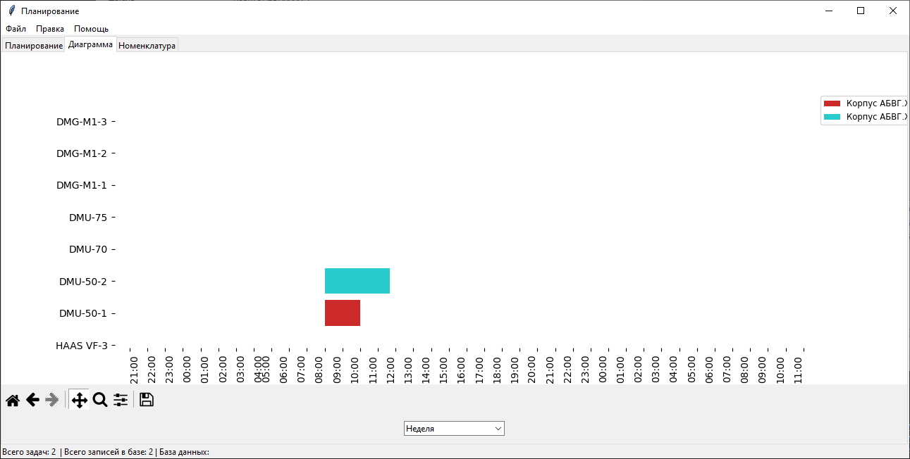
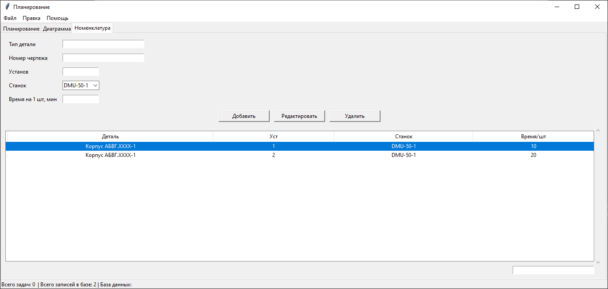

# Руководство пользователя

## Оглавление

- [Руководство пользователя](#руководство-пользователя)
  - [Оглавление](#оглавление)
  - [1. Главное меню](#1-главное-меню)
    - [Меню "Файл"](#меню-файл)
      - [Меню "Файл" является основным инструментом для управления программой (_см. Изображение 1_)](#меню-файл-является-основным-инструментом-для-управления-программой-см-изображение-1)
      - [Оно включает в себя следующие команды](#оно-включает-в-себя-следующие-команды)
    - [Меню "Правка"](#меню-правка)
      - [Меню "Правка" предоставляет инструменты для работы с текстом в текстовых полях приложения](#меню-правка-предоставляет-инструменты-для-работы-с-текстом-в-текстовых-полях-приложения)
    - [Меню "Справка"](#меню-справка)
      - [Меню "Справка" предоставляет информацию о программе](#меню-справка-предоставляет-информацию-о-программе)
    - [Окно настроек](#окно-настроек)
      - [Загрузка и сохранение настроек](#загрузка-и-сохранение-настроек)
      - [Добавление и удаление станков](#добавление-и-удаление-станков)
  - [2. Главное окно приложения](#2-главное-окно-приложения)
    - [Вкладка "Планирование"](#вкладка-планирование)
      - [Вкладка "Планирование" предназначена для ввода и управления задачами, связанными с производственными процессами (см. Изображение 3)](#вкладка-планирование-предназначена-для-ввода-и-управления-задачами-связанными-с-производственными-процессами-см-изображение-3)
      - [Основные элементы интерфейса](#основные-элементы-интерфейса)
      - [Кнопки управления задачами](#кнопки-управления-задачами)
      - [Фильтрация](#фильтрация)
    - [Вкладка "Диаграмма"](#вкладка-диаграмма)
      - [Вкладка "Диаграмма" отвечает за визуализацию планирования задач в виде диаграммы Ганта (см. Изображение 4)](#вкладка-диаграмма-отвечает-за-визуализацию-планирования-задач-в-виде-диаграммы-ганта-см-изображение-4)
    - [Вкладка "Номенклатура"](#вкладка-номенклатура)
      - [Вкладка "Номенклатура" позволяет управлять информацией о номенклатуре изделий и их характеристиках (см. Изображение 5)](#вкладка-номенклатура-позволяет-управлять-информацией-о-номенклатуре-изделий-и-их-характеристиках-см-изображение-5)
  - [3. Клавиатурные сочетания](#3-клавиатурные-сочетания)
  - [4. Дополнительные функции](#4-дополнительные-функции)
    - [Управление задачами](#управление-задачами)
    - [Автоматические расчеты](#автоматические-расчеты)
  - [5. Работа с данными](#5-работа-с-данными)
    - [Импорт/экспорт](#импортэкспорт)
    - [Рекомендации по работе с данными](#рекомендации-по-работе-с-данными)
  - [6. Решение проблем](#6-решение-проблем)
    - [Частые вопросы](#частые-вопросы)
    - [Техническая поддержка](#техническая-поддержка)
  - [7. Безопасность](#7-безопасность)
    - [Рекомендации по защите данных](#рекомендации-по-защите-данных)
    - [Хранение данных](#хранение-данных)
  - [8. Лицензионное соглашение](#8-лицензионное-соглашение)
    - [Права использования](#права-использования)
    - [Ограничения](#ограничения)
    - [Гарантии](#гарантии)

---

## 1. Главное меню

### Меню "Файл"

#### Меню "Файл" является основным инструментом для управления программой (_см. Изображение 1_)
<!-- markdownlint-disable MD033 -->

  

    
    
Изображение 1

  

#### Оно включает в себя следующие команды

- **Открыть базу данных**

  Позволяет пользователю выбрать и открыть CSV файл, содержащий данные о номенклатуре изделий. Приложение проверяет содержимое файла и импортирует данные, если они верны. Если база данных не открывается или открывается с ошибками, рекомендуется изменить в окне настроек разделитель CSV файла или кодировку.

- **Сохранить базу данных**

  Сохраняет текущее состояние данных в открытой базе данных. Если база данных не открыта, приложение предложит пользователю сохранить данные в новом файле.

- **Закрыть базу данных**

  Закрывает открытую базу данных. Если база данных была изменена, приложение предложит пользователю сохранить данные в этом файле.

- **Импорт задач из Excel**

  Позволяет импортировать задачи из Excel файла. Пользователь выбирает файл, и данные загружаются в приложение. Для первичной инициализации списка задач требуется выполнить команду "Экспорт задач в Excel" для получения шаблона Excel файла, подготовленного для работы с программой.

- **Экспорт задач в Excel**

  Экспортирует текущие задачи в указанный Excel файл. Данные могут быть структурированы по заданным пользователем параметрам.

- **Экспорт диаграммы в Excel**

  Экспортирует задачи и диаграмму в Excel файл.

- **Настройки**

  Открывает новое окно с параметрами конфигурации приложения. Пользователь может изменять различные настройки, включая стиль интерфейса, разделитель CSV файла (для корректного импорта/экспорта базы данных на разных операционных системах), кодировку файлов CSV и список моделей станков, применяемых на данном производстве.

- **Выход**

  Закрывает текущее окно приложения.

---

### Меню "Правка"

#### Меню "Правка" предоставляет инструменты для работы с текстом в текстовых полях приложения

- **Вырезать**

  Удаляет выделенный текст или данные и помещает их в буфер обмена, позволяя пользователю вставить их в другое место.

- **Копировать**

  Копирует выделенный текст или данные в буфер обмена, не удаляя их из текущего положения. Пользователь может вставить их в другом месте после выполнения этой команды.

- **Вставить**

  Вставляет содержимое буфера обмена в текущее положение курсора. Если в буфере обмена содержится текст или данные, они будут добавлены в активное текстовое поле или таблицу.

- **Выделить все**

  Выделяет все текстовые данные или записи в текущем контексте (например, все строки в таблице или весь текст в текстовом поле). Это позволяет пользователю легко скопировать или удалить все данные сразу.

---

### Меню "Справка"

#### Меню "Справка" предоставляет информацию о программе

- **О программе**

  Открывает окно с информацией о приложении, его версии и авторе.

- **Руководство пользователя**

  Этот файл содержит полное руководство по использованию программы.

---

### Окно настроек

  

    
    
Изображение 2

  

  
Окно настроек приложения, где пользователь может изменить параметры и добавить станки (см. Изображение 2). Оно включает в себя следующие команды:

- **Добавить станок**

  В верхней части окна находится поле для ввода нового станка. Пользователь может ввести название нового станка и нажать кнопку "Добавить", чтобы добавить его в список.

- **Список станков**

  Отображает текущий список всех добавленных станков. Пользователь может выбрать станок из списка и нажать кнопку "Удалить", чтобы удалить его.

- **Выбрать стиль**

  Позволяет пользователю выбрать стиль интерфейса из предложенного списка. Это изменяет внешний вид приложения в соответствии с выбранным стилем.

- **Разделитель CSV**

  Пользователь может указать символ, который будет использоваться в качестве разделителя при работе с CSV файлами. По умолчанию это точка с запятой, но пользователь может изменить его на другой символ, если это необходимо.

- **Выбрать кодировку**

  Позволяет выбрать кодировку для CSV файлов базы данных, которые будут использоваться в приложении. Варианты включают "windows-1251" и "utf-8".

- **Кнопки управления:**

  - **По умолчанию**
    Сбрасывает настройки к значениям по умолчанию.

  - **OK**
    Сохраняет изменения и закрывает окно настроек.

  - **Отмена**
    Закрывает окно настроек без сохранения изменений.

#### Загрузка и сохранение настроек

Настройки загружаются из файла `settings.json`, если он существует и не пуст. В противном случае загружаются значения по умолчанию. При сохранении настроек данные записываются в тот же файл.

#### Добавление и удаление станков

Пользователь может добавлять новые станки, и они будут отображаться в списке. Если пользователь попытается добавить уже существующий станок, появится предупреждение. Аналогично, пользователь может удалить выбранный станок из списка.

---

## 2. Главное окно приложения

### Вкладка "Планирование"

  

    
    
Изображение 3

  

#### Вкладка "Планирование" предназначена для ввода и управления задачами, связанными с производственными процессами (см. Изображение 3)

#### Основные элементы интерфейса

- **Поле ввода "Деталь"**

  Используется для ввода названия детали с автозаполнением, обеспечивая удобство выбора.

- **Поле ввода "Установ"**

  Ввод информации о конкретной установке(операции).

- **Выпадающий список "Станок"**

  Позволяет выбрать доступный станок из списка всех станков.

- **Поле ввода "Количество, шт"**

  Ввод количества деталей для обработки.

- **Поле ввода "Время на 1 шт, мин"**

  Ввод времени, необходимого для обработки одной детали в минутах.

- **Поле ввода "Время на наладку партии, мин"**

  Ввод времени, необходимого для наладки оборудования перед запуском партии в минутах.

- **Календарь "Дата запуска"**

  Позволяет выбрать дату, на которую планируется запуск задачи.

- **Поле выбора "Время запуска"**

  Позволяет выбрать время, в которое планируется запуск задачи.

#### Кнопки управления задачами

- **Запрос в базу**

  Отправляет запрос на получение данных времени на изготовление одной детали. Для запроса должны быть заполнены следующие поля:

  - **Деталь**
  - **Установ**
  - **Станок**

  При успешной проверке совпадающих значений в таблице "Номенклатура" будет заполнено поле ввода "Время на 1 шт, мин".

- **Добавить**

  Добавляет новую задачу в таблицу.

- **Редактировать**

  Позволяет редактировать выбранную задачу. При нажатии появляется диалог редактирования, где можно исправить данные следующих колонок:

  - **Деталь**
  - **Установ**
  - **Станок**

- **Удалить**

  Удаляет выбранную задачу из таблицы.

- **Очистить**

  Очищает всю таблицу "Задачи".

- **Таблица "Задачи"**

  Таблица, отображающая все добавленные задачи с колонками:

  - **ID (идентификатор)**
  - **Деталь**
  - **Уст**
  - **Станок**
  - **Кол-во**
  - **Время/шт**
  - **Дата запуска**
  - **Дата окончания**

  Таблица позволяет сортировать строки по алфавиту (двойной клик левой кнопкой мыши по верхней колонке). Также если выделить строку и нажать на **Enter**, то появится диалог редактирования, где можно исправить данные следующих колонок:

  - **Деталь**
  - **Уст**
  - **Станок**

  Если необходимо удалить задачу, то достаточно нажать на **Delete**. Есть поддержка удаления нескольких или всех строк через `Ctrl + A`.

#### Фильтрация

Поле для фильтрации строк в таблице задач.

---

### Вкладка "Диаграмма"

  

    
    
Изображение 4

  

#### Вкладка "Диаграмма" отвечает за визуализацию планирования задач в виде диаграммы Ганта (см. Изображение 4)

- **Выпадающий список "Диапазон"**

  Позволяет выбирать отображаемый временной диапазон (день, неделя, месяц) для диаграммы.

- **Диаграмма**

  Создается с использованием библиотеки Matplotlib, отображает задачи в зависимости от выбранного диапазона времени, группируя их по станкам.

- **Панель навигации**

  Обеспечивает управление диаграммой (масштабирование и перемещение).

---

### Вкладка "Номенклатура"

  

    
    
Изображение 5

  

#### Вкладка "Номенклатура" позволяет управлять информацией о номенклатуре изделий и их характеристиках (см. Изображение 5)

- **Поле ввода "Тип детали"**

  Для ввода информации о типе детали.

- **Поле ввода "Номер чертежа"**

  Для ввода номера чертежа детали.

- **Поле ввода "Установ"**

  Для указания установки, аналогично вкладке "Планирование".

- **Выпадающий список "Станок"**

  Для выбора станка, аналогично вкладке "Планирование".

- **Поле ввода "Время на 1 шт, мин"**

  Ввод времени, необходимого для обработки одной детали в минутах, аналогично вкладке "Планирование".

- **Кнопки управления номенклатурой:**

  - **Добавить**

    Добавляет новую запись в таблицу "Номенклатура".

  - **Редактировать**

    Позволяет редактировать выбранную запись таблицы "Номенклатура". При нажатии появляется диалог редактирования, где можно исправить данные выделенной записи таблицы.

  - **Удалить**

    Удаляет выделенную задачу из таблицы "Номенклатура".

- **Таблица "Номенклатура"**

  Таблица, отображающая все добавленные задачи с колонками:

  - **ID(идентификатор)**
  - **Деталь**
  - **Уст**
  - **Станок**
  - **Время/шт**

  Функциональность аналогичная таблицы на вкладке "Планирование"

---

## 3. Клавиатурные сочетания

| Сочетание клавиш | Действие                                      |
| ---------------- | --------------------------------------------- |
| `Ctrl + O`       | Открыть базу данных                           |
| `Ctrl + S`       | Сохранить базу данных                         |
| `Ctrl + Q`       | Выход из программы                            |
| `Ctrl + C`       | Копировать выделенный элемент                 |
| `Ctrl + X`       | Вырезать выделенный элемент                   |
| `Ctrl + V`       | Вставить скопированный или вырезанный элемент |
| `Ctrl + A`       | Выделить всё                                  |
| `F1`             | Окно "О программе"                            |

---

## 4. Дополнительные функции

### Управление задачами

- **Групповые операции**  
  Для выделения нескольких задач используйте:

  - `Shift + клик` - выделение диапазона
  - `Ctrl + клик` - выборочное выделение
  - `Ctrl + A` - выделить все задачи

- **Контекстное меню**  
  Правый клик по задаче открывает меню с быстрыми действиями:
  - Копировать данные
  - Удалить задачу
  - Редактировать задачу

### Автоматические расчеты

- **Время выполнения**  
  При добавлении задачи автоматически рассчитывается:
  `Общее время = (Время на 1 шт × Количество) + Время наладки`

- **Дата окончания**  
  Рассчитывается на основе:
  - Дата/время начала
  - Общего времени выполнения

---

## 5. Работа с данными

### Импорт/экспорт

| Формат | Возможности                       | Ограничения                    |
| ------ | --------------------------------- | ------------------------------ |
| CSV    | Полный импорт/экспорт базы данных | Требуется правильная кодировка |
| Excel  | Импорт задач, экспорт отчетов     | Максимум 1000 строк за раз     |
| JSON   | Экспорт настроек и конфигураций   | Только для технических целей   |

### Рекомендации по работе с данными

1. **Перед импортом:**

   - Проверьте соответствие формата данных
   - Сделайте резервную копию текущих данных

2. **При экспорте:**

   - Выбирайте нужный диапазон дат
   - Указывайте понятные названия файлов

3. **Оптимальные практики:**
   - Регулярное сохранение данных (каждые 30 минут)
   - Использование фильтров перед экспортом
   - Очистка старых задач (раз в месяц)

---

## 6. Решение проблем

### Частые вопросы

**Проблема:** Данные не сохраняются

**Решение:**

1. Проверьте права доступа к папке
2. Убедитесь, что файл не открыт в другой программе
3. Попробуйте сохранить под другим именем

**Проблема:** Ошибки при импорте CSV

**Решение:**

1. Проверьте разделитель в настройках
2. Убедитесь в правильности кодировки
3. Проверьте целостность файла

**Проблема:** Диаграмма не обновляется

**Решение:**

1. Нажмите кнопку "Обновить"
2. Проверьте диапазон дат
3. Перезапустите приложение

### Техническая поддержка

**Для обращения в поддержку подготовьте:**

1. Версию программы (см. "О программе")
2. Скриншот ошибки
3. Копию последнего сохраненного файла

**Контакты поддержки:**

  **Email:** [maestrofusion360@gmail.com](maestrofusion360@gmail.com)

---

## 7. Безопасность

### Рекомендации по защите данных

**Регулярное резервное копирование** — сохраняйте копии всех важных данных, включая CSV файлы, в отдельном месте, например, на внешнем носителе или в облачном хранилище. Рекомендуется делать резервные копии как минимум раз в неделю. Также используйте **управление версиями** данных, чтобы в случае необходимости можно было восстановить более старые версии файлов.

### Хранение данных

- Все данные хранятся локально на вашем компьютере
- Программа не отправляет данные в интернет
- Настройки сохраняются в файле `settings.json`

---

## 8. Лицензионное соглашение

### Права использования

Программа распространяется по лицензии **MIT**.  
Пользователь может свободно использовать программное обеспечение в любых целях, включая коммерческие. Разрешено копирование, изменение, слияние, публикация, распространение, сублицензирование и продажа копий программы.

### Условия

При использовании требуется сохранение уведомления об авторском праве и текста лицензии во всех копиях и производных работах.

### Ограничение ответственности

Программа предоставляется как есть, без гарантий работоспособности или пригодности под конкретные задачи. Автор не несет ответственности за любые убытки и последствия использования программного продукта.

---
